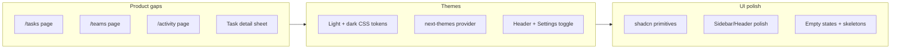

# Aegis PM — Gap Fill, Themes & Elegant Polish

## Reality check vs [Notes/Execution.md](Notes/Execution.md)

Execution.md says **40/40 complete**. The API is largely there; the web app is **~70–75%** of the claimed surface.

| Claimed | Actual gap |
|---------|------------|
| Tasks / Teams / Activity nav | Sidebar links to `/tasks`, `/teams`, `/activity` — **no pages** |
| Board task UX | Kanban/list/table expose `onTaskClick` / create — **never wired** |
| Theme preference (`User.theme`) | Typed only; HTML hardcodes `dark`; **no light tokens or toggle** |
| Elegant UI kit | Only `button`, `dialog`, `input`, `label` under `components/ui/` |
| Labels | Model exists in API — **no routes/UI** |
| Comments | Full API — **no task-detail comment UI** |

**Chosen scope (default):** fill product-breaking gaps + dual themes + elegant polish across existing surfaces. Defer billing, custom roles CRUD, and full a11y audit.

---

## Phase A — Dual theme system

**Files:** [globals.css](project-management-web/src/app/globals.css), [layout.tsx](project-management-web/src/app/layout.tsx), new `providers/theme-provider.tsx`, header + settings profile.

1. Restructure CSS variables:
   - `:root` → **light** tokens (clean zinc/slate surfaces, keep primary accent but avoid generic purple-on-white overload — refine existing `250 84% 54%` primary for both modes).
   - `.dark` → move current dark values here.
2. Add `next-themes` with `attribute="class"`, `defaultTheme="system"`, `enableSystem`.
3. Remove hardcoded `dark` class from root layout; wrap with `ThemeProvider`.
4. Theme toggle in header + Settings → Profile (syncs with existing `User.theme?: 'dark' | 'light' | 'system'` via `PATCH /users/profile` if backend accepts it; otherwise local + `localStorage` via next-themes).
5. Update FullCalendar overrides to use CSS variables (already mostly token-based) so light mode works.

---

## Phase B — Missing pages (API already exists)

### 1. `/tasks` — [new `app/(dashboard)/tasks/page.tsx`](project-management-web/src/app/(dashboard)/tasks/page.tsx)
- My tasks across workspace (reuse `useTasks` / dashboard personal tasks patterns).
- Filters: status, priority, assignee (me/all), search.
- Quick create + open task detail sheet.
- Support `?create=true` for command palette.

### 2. `/teams` — [new `app/(dashboard)/teams/page.tsx`](project-management-web/src/app/(dashboard)/teams/page.tsx)
- List teams for current workspace (`/api/teams?workspaceId=`).
- Create team modal; team detail with members, lead, stats.
- Wire new `team-service.ts` + `use-teams.ts` if missing.

### 3. `/activity` — [new `app/(dashboard)/activity/page.tsx`](project-management-web/src/app/(dashboard)/activity/page.tsx)
- Workspace timeline via existing [activity-service](project-management-web/src/services/) / `use-activities`.
- Filters by project; infinite/paginated feed; polished empty state.

### 4. Nav fixes
- Command palette dashboard → `/dashboard` (not `/`).
- Ensure Analytics/Admin reachable from Settings or secondary nav (pages exist, not in main sidebar — add under Settings hub links only to avoid clutter).

---

## Phase C — Task detail & create (core missing UX)

On [projects/[projectId]/page.tsx](project-management-web/src/app/(dashboard)/projects/[projectId]/page.tsx):

1. **Task detail sheet** (slide-over): title, status, priority, assignees, due date, labels, description, subtasks, time log, comments (Tiptap-lite or markdown textarea first), activity snippet.
2. Wire `onTaskClick` from Kanban / List / Table → open sheet.
3. **Quick create** dialog/sheet from board + Tasks page + ⌘K.
4. Reuse existing hooks: `useCreateTaskMutation`, `useUpdateTaskMutation`, comment/attachment services where present.

API comments/attachments already exist — this is primarily frontend composition.

---

## Phase D — Elegant UI foundation (no lint)

Expand thin kit under `components/ui/` (shadcn-compatible, match existing CVA patterns):

- `sheet`, `dropdown-menu`, `select`, `badge`, `avatar`, `tabs`, `separator`, `skeleton`, `tooltip`, `switch`, `textarea`, `card` (cards only for interactive containers per design rules).

Then polish shell:
- Sidebar/header: clearer hierarchy, subtle motion (`framer-motion` already in deps), theme-aware surfaces.
- Shared `EmptyState`, loading skeletons on Tasks/Teams/Activity/boards.
- Calendar + auth pages respect light/dark.

**Lint gate:** after each phase run `npm run lint` + `tsc`/build in web (and API if touched). Fix all issues before moving on — no `@ts-ignore` debt.

---

## Phase E — Small API gaps only if needed for UI

Touch API only where frontend would otherwise be blocked:

1. **Labels CRUD** under `/api/labels` (model already at `modules/labels/`) — needed for task detail labels.
2. **Workspace get/update/delete** if settings page calls missing routes (verify [workspace settings page](project-management-web/src/app/(dashboard)/settings/workspace/page.tsx) against [workspaces routes](project-management-api/src/modules/workspaces/)).
3. Persist `theme` on user profile if not already in validation schema.

No billing, no custom role builder, no Sentry wiring in this pass.

---

## Design direction (elegant, both themes)

- Preserve Aegis brand; strengthen first-viewport identity on landing only if touching it lightly.
- Light: soft gray canvas, crisp borders, high-contrast text — not cream/serif cliché.
- Dark: keep current zinc/purple system, refine contrast.
- Motion: 2–3 intentional transitions (sidebar collapse, sheet enter, theme crossfade) — not noise.
- Within app shell: follow existing dashboard patterns; don’t invent a new marketing layout inside authenticated pages.

---

## Verification

1. `npm run lint` + `npm run build` in `project-management-web` — zero errors.
2. `npm run lint` + `npm run build` in `project-management-api` if API changed.
3. Manual smoke: login → dashboard → projects board → open task → create task → tasks/teams/activity pages → toggle light/dark → refresh persistence.
4. Confirm no 404s from sidebar or ⌘K.